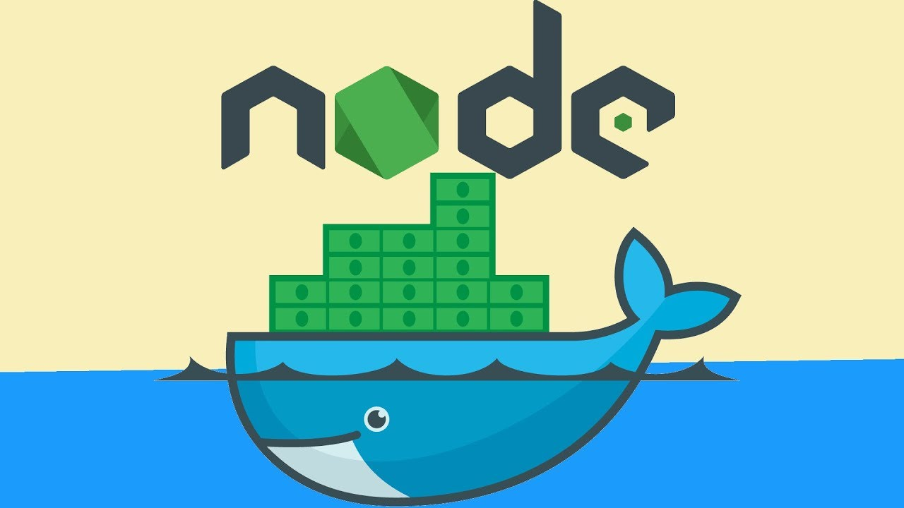
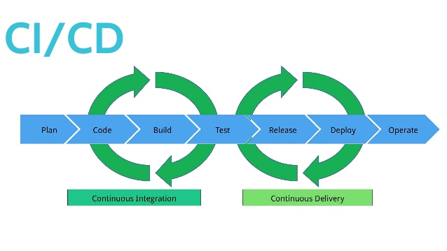
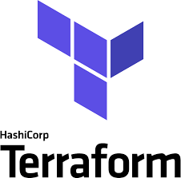
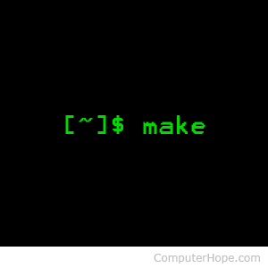

# Reto-DevOps


Este reto técnico fue diseñado para mostrar tus habilidades DevOps a través del uso de herramientas y plataformas que utilizamos en el día a día.

En este caso, el desafío busca que implementes una aplicación simple en NodeJs.

De todas maneras, recuerda que DevOps `es más que el uso de herramientas, es una filosofía, una metodología de colaboración entre desarrollo y operaciones` con el foco de acelerar el time-to-market.

## Antes de comenzar:

Te recomendamos leer las siguientes instrucciones:

1. Lee las instrucciones de cada fase del reto
2. Si no tienes suficiente información o experiencia en lo que pide cada etapa del reto, no te preocupes puedes consultar, "googlear" o revisar la documentación de cada tecnología o herramienta a utilizar. La idea es que aprendamos haciendo con este desafío.
3. No hay estructura u orden definido ara realizar el reto, pero si puedes ordenarlo para ser comprendido por humanos sería genial!
4. Y recuerda, si estás haciendo este reto es que ya vas cruzando por la senda del DevOps! :D

## La app


```bash
$ git clone https://github.com/bydefault-cl/reto-devops.git
Cloning into 'reto-devops'...
remote: Enumerating objects: 3, done.
remote: Counting objects: 100% (3/3), done.
remote: Compressing objects: 100% (2/2), done.
remote: Total 3 (delta 0), reused 0 (delta 0)
Receiving objects: 100% (3/3), done.
$ cd ./reto-devops

```

### Instalar Dependencias

```bash
$ npm install
npm WARN basicservice@1.0.0 No repository field.
npm WARN optional SKIPPING OPTIONAL DEPENDENCY: fsevents@2.1.2 (node_modules/fsevents):
npm WARN notsup SKIPPING OPTIONAL DEPENDENCY: Unsupported platform for fsevents@2.1.2: wanted {"os":"darwin","arch":"any"} (current: {"os":"linux","arch":"x64"})

added 530 packages from 308 contributors and audited 1203947 packages in 34.589s

21 packages are looking for funding
  run `npm fund` for details

found 0 vulnerabilities
```

### Ejecutar Test


```bash
$ npm run test

> basicservice@1.0.0 test /basic-unit-test
> jest

 PASS  tests/sum.test.js
 PASS  tests/string.test.js

Test Suites: 2 passed, 2 total
Tests:       3 passed, 3 total
Snapshots:   0 total
Time:        5.655s
Ran all test suites.
```

### Ejecutar la app

```bash
$ node index.js
Example app listening on port 3000!
```

Podrá acceder a la API localmente en el puerto `3000`.

```bash
$ curl -s localhost:3000/ | jq
{
  "msg": "ApiRest prueba"
}
$ curl -s localhost:3000/public | jq
{
  "public_token": "12837asd98a7sasd97a9sd7"
}
$ curl -s localhost:3000/private | jq
{
  "private_token": "TWFudGVuIGxhIENsYW1hIHZhcyBtdXkgYmllbgo="
}
```

## El reto comienza aquí

Te recomendamos hacer un **fork** de este repositorio para completar el reto en tu propia cuenta de `gitlab | github | bitbucket | etc.`.

Puedes usar la metodología de branching que más te acomode y ojalá quede plasmada en el repo!. Usas MR/PR, genial!

Si tiene alguna duda o encuentras algún problema en el reto, adelante, [abre un issue](https://github.com/bydefault-cl/reto-devops/issues).

### Reto 1. Dockerize la aplicación



¿Qué pasa con los contenedores?. Los contenedores son un estándar para implementar aplicaciones **(en la nube o en sistemas locales)**. Entonces, el reto es:

1. Construir la imagen más pequeña que pueda. Escribe un buen Dockerfile :)
2. Ejecutar la app como un usuario diferente de root.

### Reto 2. Docker Compose


Una vez que haya dockerizado todos los componentes de la API _(aplicación de NodeJS)_, estarás listo para crear un archivo docker-compose. Docker Compose es ideal para levantar ambientes de desarrollo antes de empezar a escribir un pipeline. Ya que la aplicación se ejecuta sin ninguna capa para el manejo de protocolo http, añade:

1. Nginx que funcione como proxy reverso a nuesta app Nodejs
2. Asegurar el endpoint /private con auth_basic
3. Habilitar https y redireccionar todo el trafico 80 --> 443

### Reto 3. Probar la aplicación en cualquier sistema CI/CD



Como buen DevOps, conoces las ventajas de ejecutar tareas de forma automatizada. Hay algunos sistemas de CICD que pueden usarse para que esto suceda. Elige uno, Github Actions, Gitlab-CI, Travis-CI, Drone-CI , Circle-CI, etc ... lo que quieras. Crea una tubería exitosa!.

- Si deseas agregar Merge-Request|Pull-Request Automatizado, genial!
- Si deseas agregar Automatic Versioning, genial!

### Reto 4. Deploy en Kubernetes


Ok,ya sabes contenedores, ahora veamos tu experiencia en K8s. Usa un sistema kubernetes para implementar la API. Puedes utilizar herramientas como Minikube, K3D o Microk8s. Si quieres desplegar en tu nube pública favorita no hay problema, ojo con los costos!.

Escriba el archivo de implementación (archivo yaml) utilizalo para implementar su API (aplicación Nodejs).

- Ideal si añades **Horizontal Pod Autoscaler** a la app NodeJS.
- Ideal si despliegas la aplicación en un namespace dedicado.
- Ideal si agregas reglas de health en el deployment.

### Reto 5. Construir Chart en Helm y manejar trafico http(s)


Helm es una de las maneras más eficientes para crear, modificar y usar aplicaciones en Kubernetes. Este reto consiste en:

1. Diseñar un chart de helm con nginx que funcione como proxy reverso a nuesta app Nodejs
2. Asegurar el endpoint /private con auth_basic
3. Habilitar https y redireccionar todo el trafico 80 --> 443

### Reto 6. Terraform



Hoy IaC == Terraform. El reto consiste en crear un módulo de Terraform que nos permita crear un **rbac.authorization de tipo Role** que solo nos permita ver los pods de nuestro **namespace donde se encuentra al app Nodejs**

### Reto 7. Automatiza el despliegue de los retos realizados



Scripting es una de las "main keys" de la automatización que busca DevOps. El reto consiste en **automatizar los retos en un script**, ya sea un Makefile, Bash, Go, Python, Ruby, Js, etc. Considera especificar cuales son las dependencias necesarias para que tu script se ejecute sin problemas.

## Disclaimer: 
Este reto es utilizado para procesos de contratación por varias compañías. Éste en particular está basado en:
<https://gitlab.com/clm-public/reto-devops>
<https://gitlab.com/laramarvis/prueba-devops>

# Happy Coding!